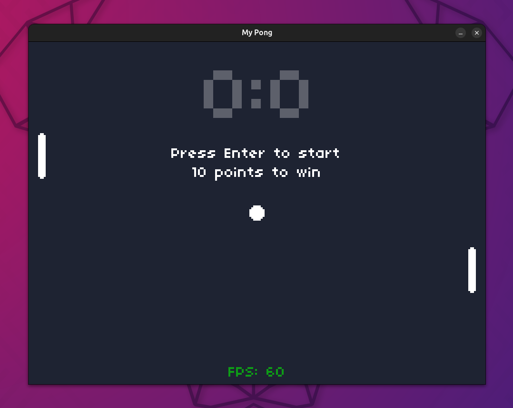
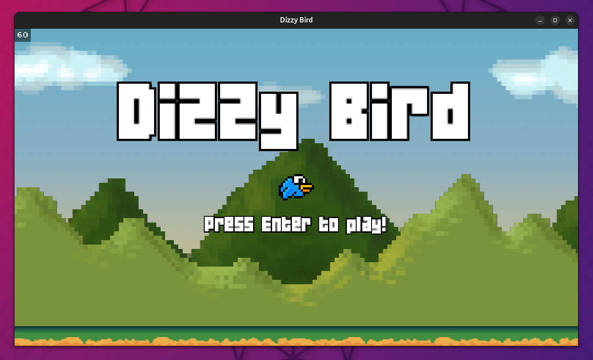
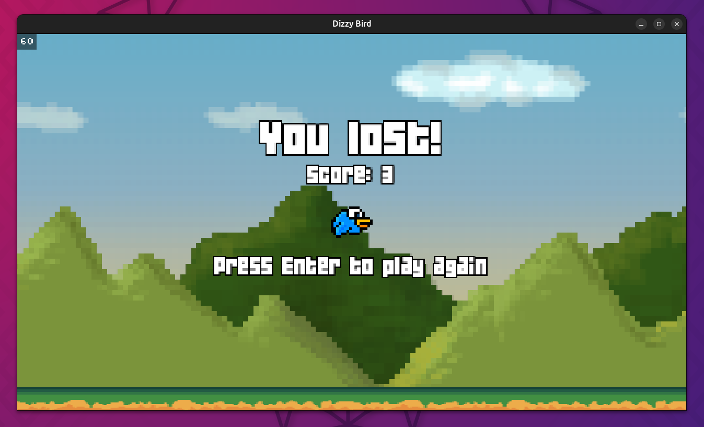
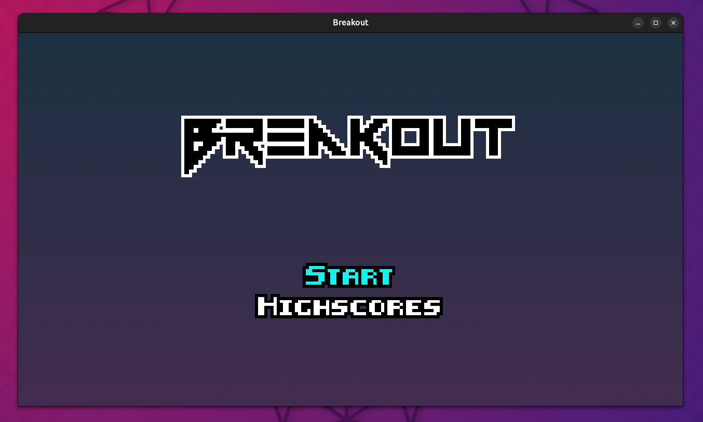
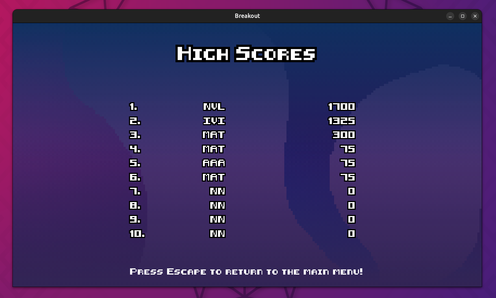
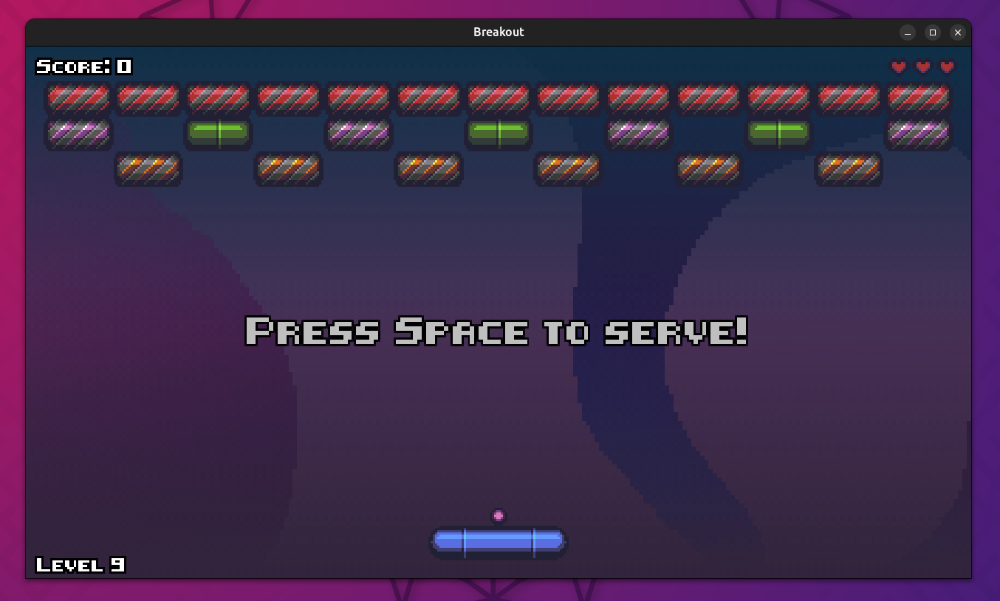

# GD50: 2D Videogames 🕹️👾🎮

My work on the first part of [**CS50's Introduction to Game Development**](https://www.edx.org/learn/game-development/harvard-university-cs50-s-introduction-to-game-development) course, offered by Harvard University. This section is about 2D videogames.  

It contains the recreated videogames of each lecture with a personal style, and the assignments of each one. Videogames are developed in **Lua**, with [LÖVE 2D](https://github.com/love2d/love) framework.  

> [!IMPORTANT]  
> To **run a game**, execute `love myGame` with LÖVE installed

## 1. Pong

Retro-aesthetic **Pong** as the classic videogame.  

| | |
|---|---|

|  |
| -- |  

Interesting topics covered by the lecture:
- DeltaTime and Velocity
- OOP
- Hitboxes (box collision)
- Game state
- Drawing shapes and text
- Sound effects 

### Assignment: AI-controlled paddles

The challenge is to implement a basic AI-controlled paddle such that both paddles will try to deflect the ball at all times. The script is implemented in the `src/main_task.lua` file.

## 2. Flappy Bird

My version of Flappy Bird, **Dizzy Bird**

| | |
|---|---|

|  |
|--| 

Interesting topics covered by the lecture:
- Procedural generation
- Infinite scrolling
- Usage of sprites
- State Machine
- Simple physics

### Assignment: Randomness, award and Pause

- Randomize the gap between trunks, so the distance between each both obstacles is not hardcoded
- Randomize the trunk pair spawn interval. Trunk pairs should spawn a random interval of few seconds apart.
- Award a “medal” in the ScoreState: Different trophies based on the points scored that life. Choose 3 different ones, as well as the minimum score needed for each.

## 3. Breakout

**Breakout** or **Arkanoid**-like videogame

|  | |
|---|---|

|  |
|--| 