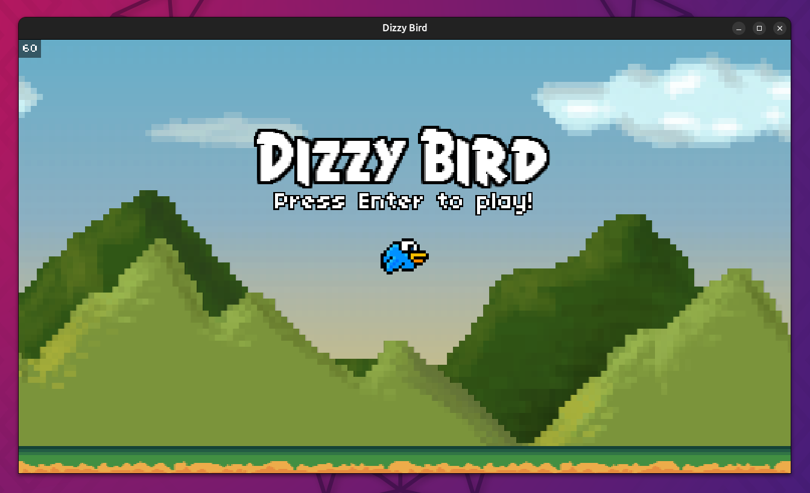
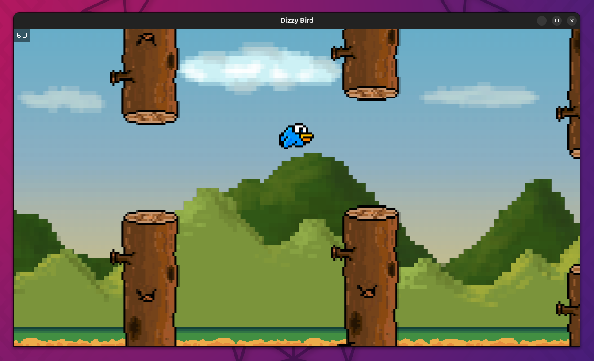

# CS50 Game Development Course 🕹️🎮

My work on the first part of [**CS50's Introduction to Game Development**](https://www.edx.org/learn/game-development/harvard-university-cs50-s-introduction-to-game-development) course, offered by Harvard University. This section is about 2D videogames.  

It contains the recreated videogames of each lecture with a personal style, and the assignments of each one. Videogames are developed in **Lua**, with [LÖVE 2D](https://github.com/love2d/love) framework.  

> [!IMPORTANT]  
> To **run a game**, execute `love myGame` with LÖVE installed

## 1. Pong

Retro-aesthetic Pong as the classic videogame.  

| | |
|---|---|

|  |
| -- |  

### Assignment: AI-controlled paddles

The challenge is to implement a basic AI-controlled paddle such that both paddles will try to deflect the ball at all times. The script is implemented in the `src/main_task.lua` file.

## 2. Flappy Bird

My version of Flappy Bird, **Dizzy Bird**

| | |
|---|---|
