# GD50: 2D Videogames 🕹️👾🎮

My work on the first part of [**CS50's Introduction to Game Development**](https://www.edx.org/learn/game-development/harvard-university-cs50-s-introduction-to-game-development) course, offered by Harvard University. This section is about 2D videogames.  

It contains the recreated videogames of each lecture with a personal style, and the assignments of each one. Videogames are developed in **Lua**, with [LÖVE 2D](https://github.com/love2d/love) framework.  

> [!IMPORTANT]  
> To **run a game**, execute `love myGame` with LÖVE installed

## 1. Pong

Retro-aesthetic **Pong** as the classic videogame.  

| |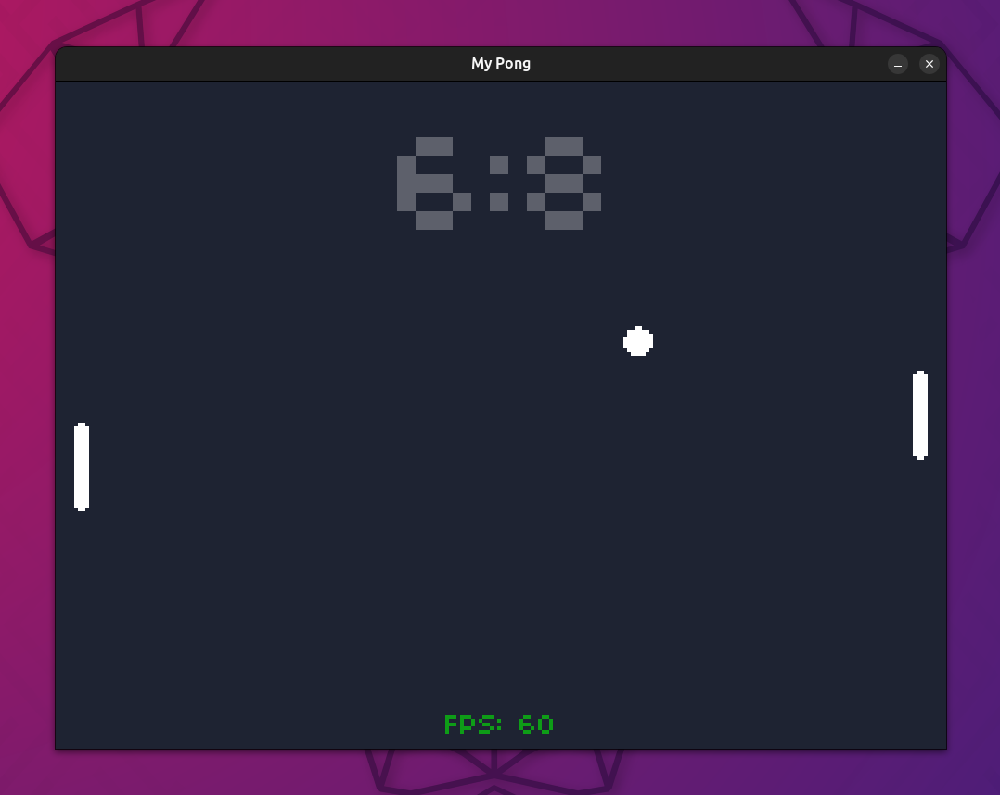 |
|---|---|

| 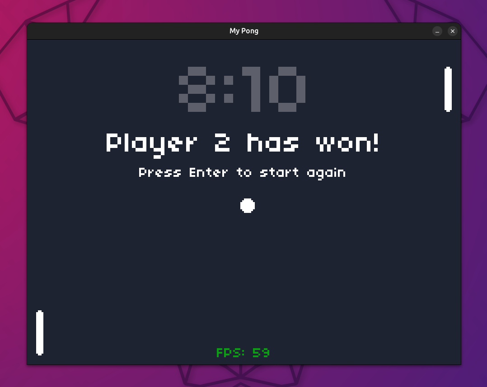 |
| -- |  

Interesting topics covered by the lecture:
- DeltaTime and Velocity
- OOP
- Hitboxes (box collision)
- Game state
- Drawing shapes and text
- Sound effects 

## 2. Flappy Bird

My version of Flappy Bird, **Dizzy Bird**

| 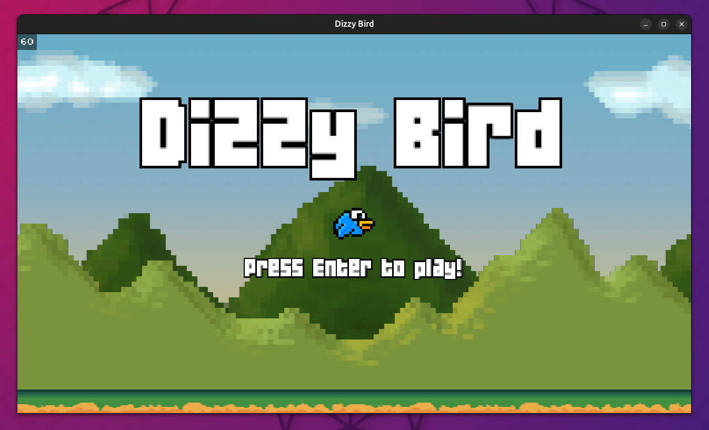|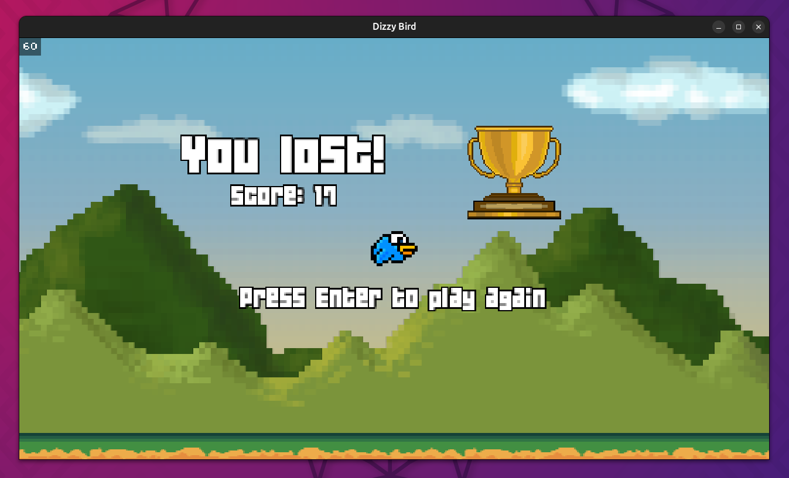 |
|---|---|

| 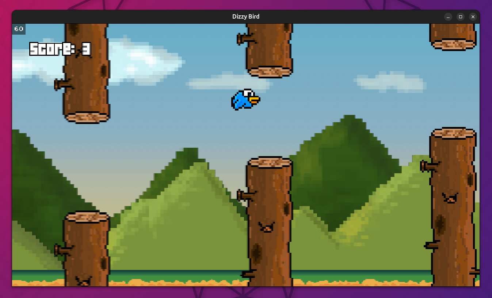 |
|--| 

Interesting topics covered by the lecture:
- Procedural generation and randomness
- Infinite scrolling
- Usage of sprites
- State Machine
- Simple physics

## 3. Breakout

**Breakout** or **Arkanoid**-like videogame

| 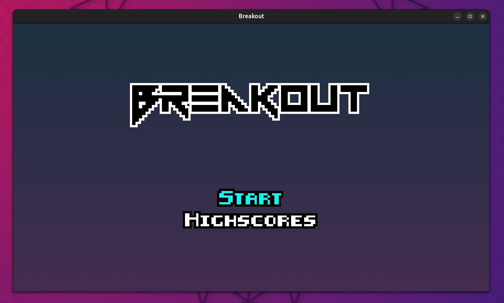 |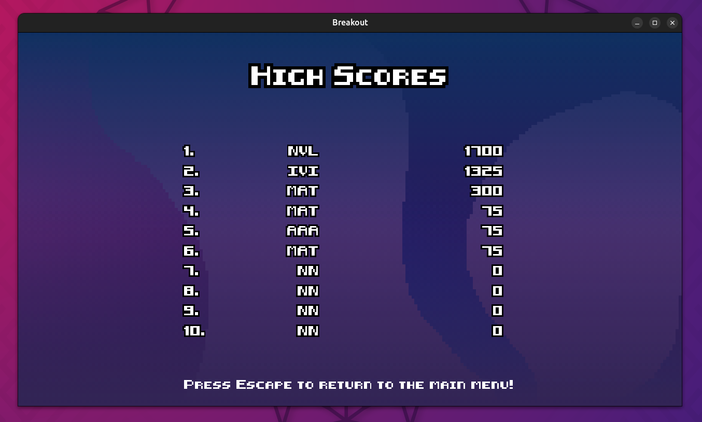 |
|---|---|

| 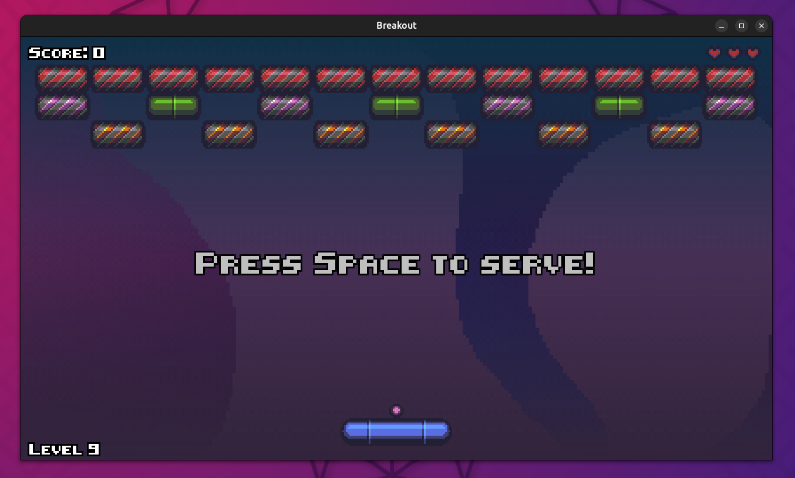 |
|--| 

Interesting topics covered by the lecture:
- Sprite sheets
- Procedural layouts and levels
- Advanced state managing
- Particle system
- Improved collision and ricochet 

## 4. Match 3

Tile-matching videogame, such as the famous puzzle games **Candy Crush** or **Bejeweled**. It incorporates the same sprites and much of the code from the course. The key learning focus was on mastering timer controls and implementing tweening for dynamic tile and color animations. 

| 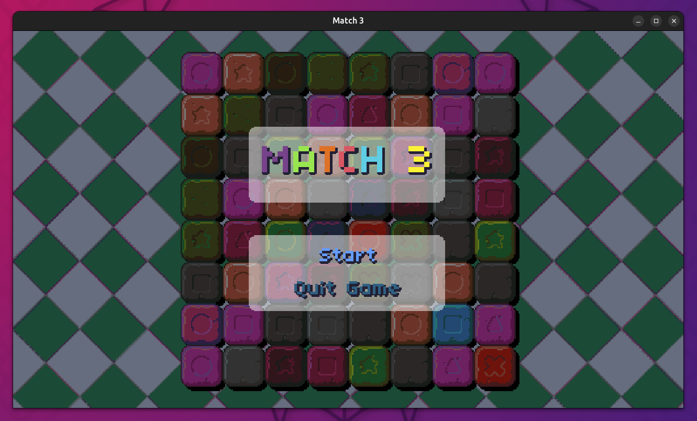 |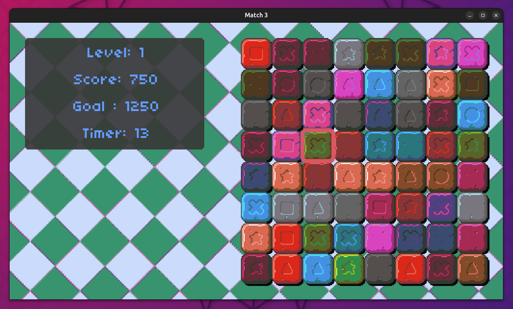 |
|---|---|

| 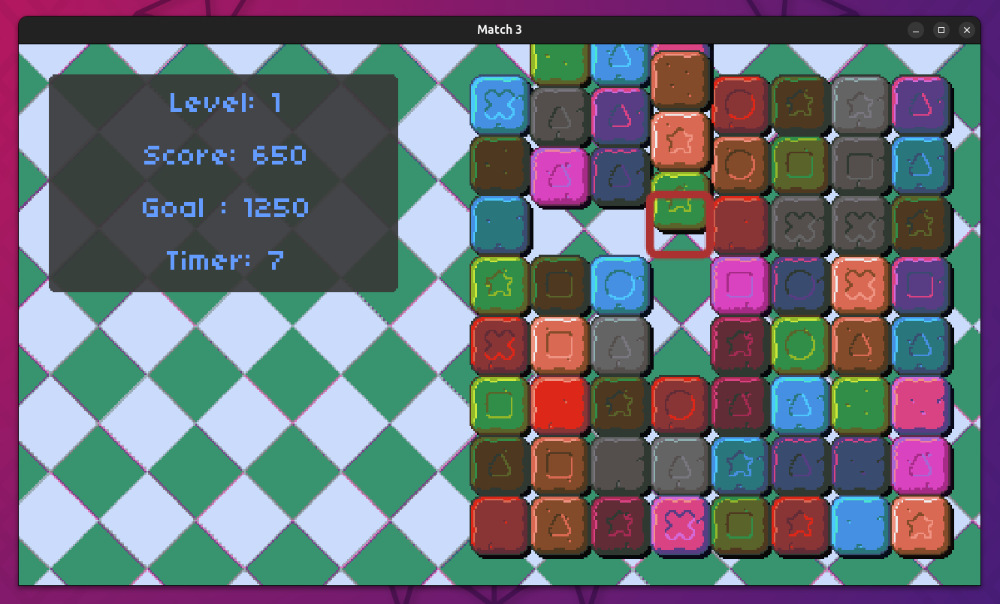 |
|--| 

Interesting topics covered by the lecture:
- Animations with tweening
- Timer machine
- Procedural grids

## 5. Mario Bros