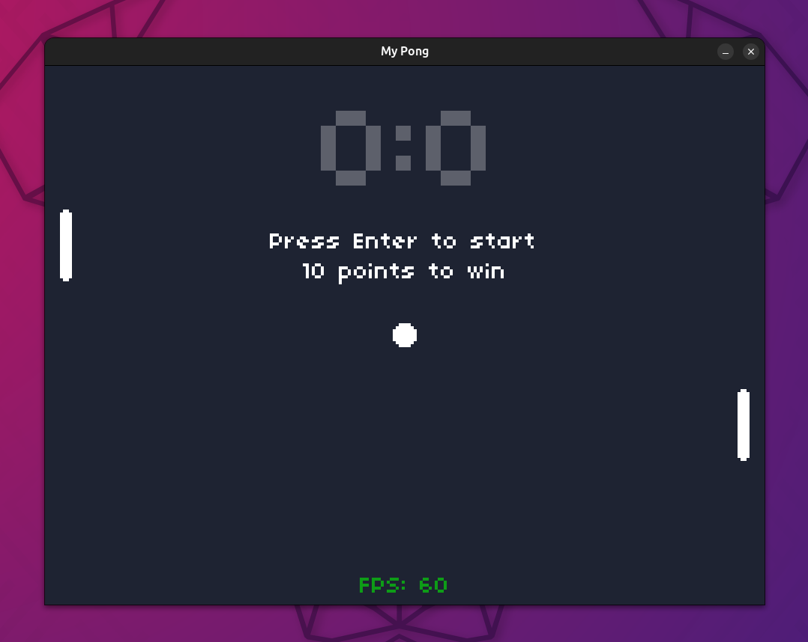
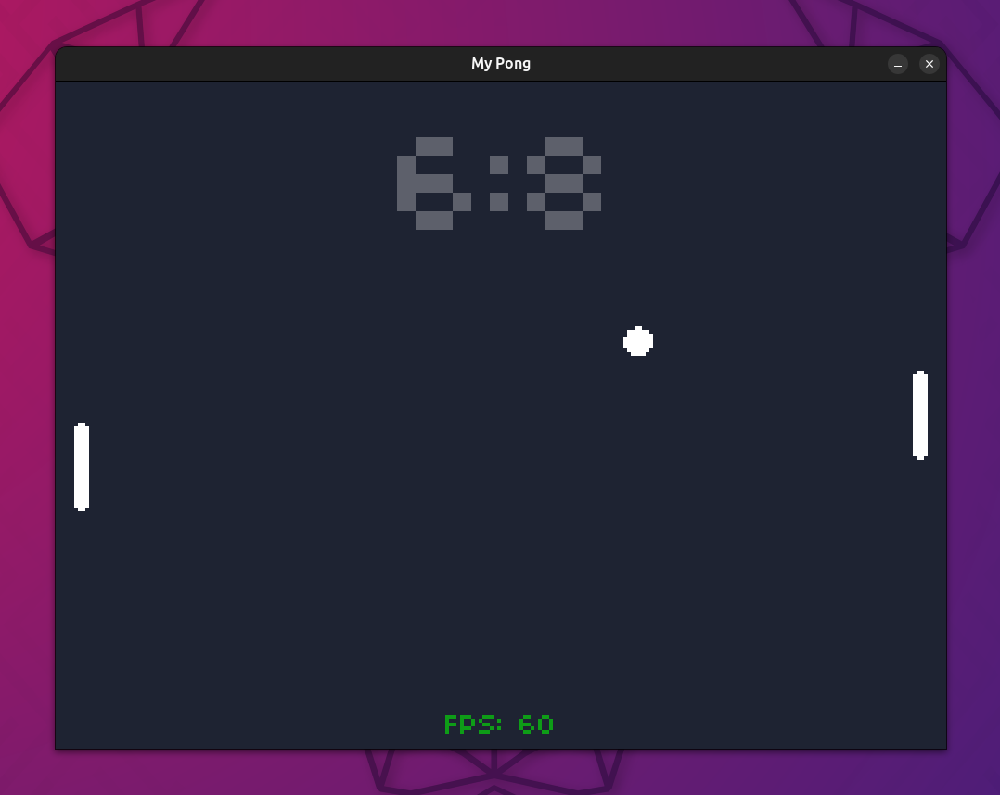
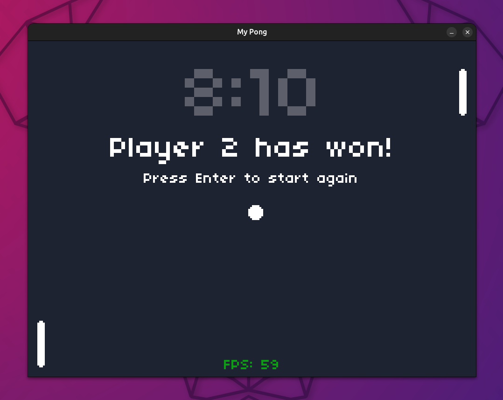
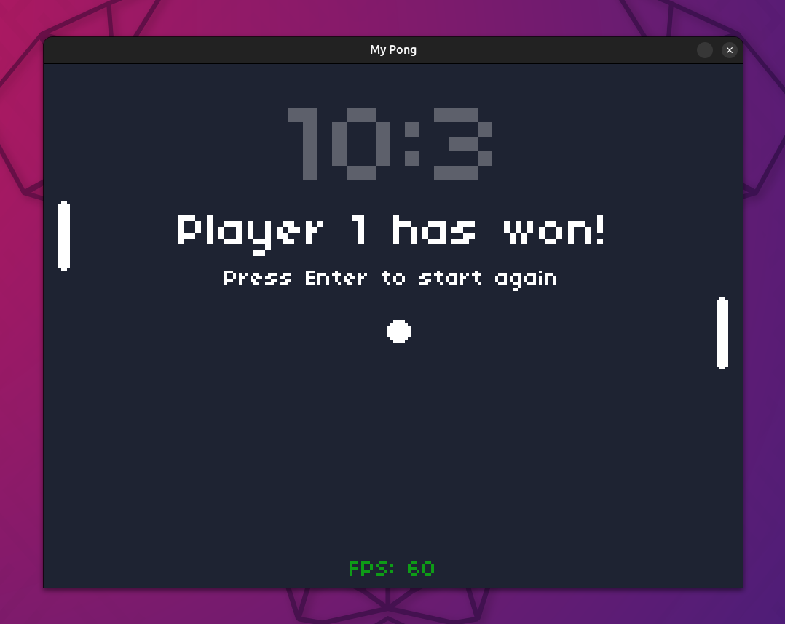

# CS50 Game Development Course 🕹️🎮

My work on [**CS50's Introduction to Game Development**](https://www.edx.org/learn/game-development/harvard-university-cs50-s-introduction-to-game-development) course offered by Harvard University.  

It contains the recreated videogames of each lecture with a personal styles, and the assignments of each one. The 2D videogames are programmed in Lua, with framework [LÖVE 2D](https://github.com/love2d/love)

## 1. Pong

Retro-aesthetic Pong as the classic videogame.  

| | |
|---|---|
|  |  |  

> TODO: fix directory `assets`