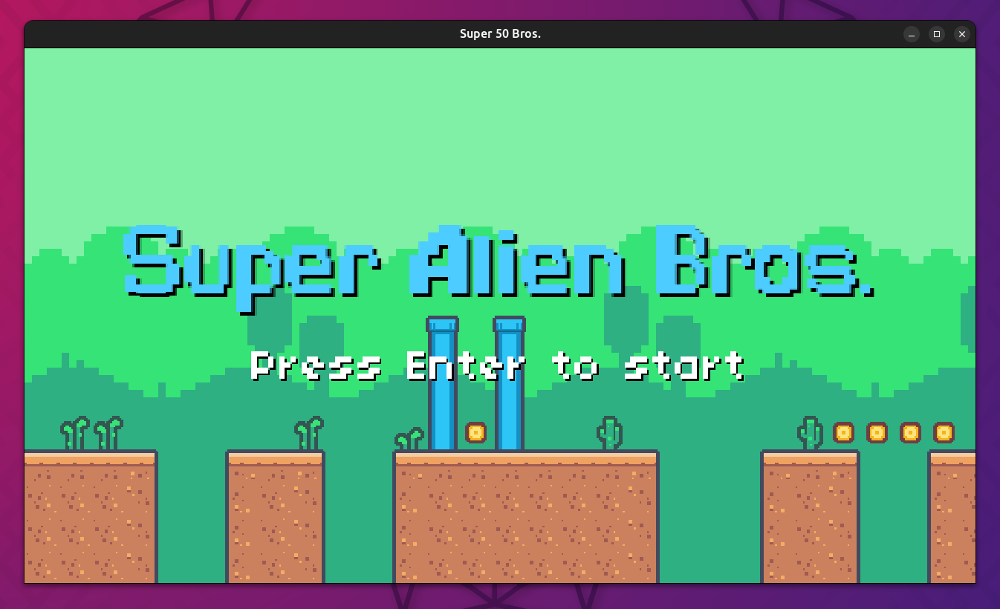
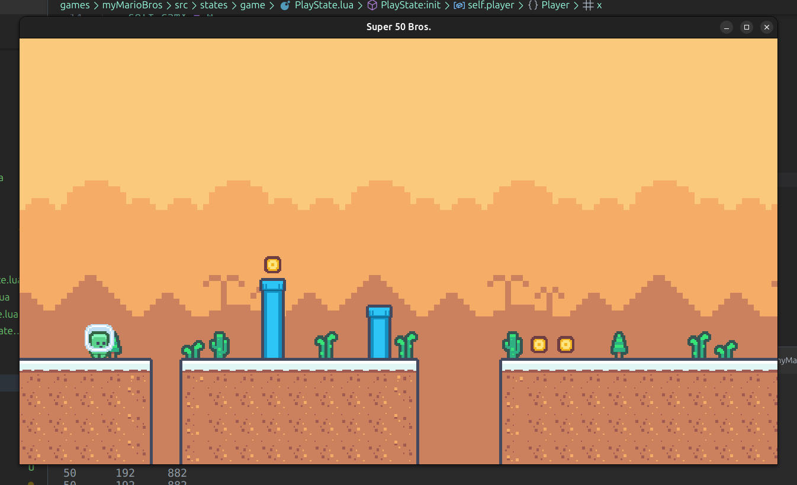
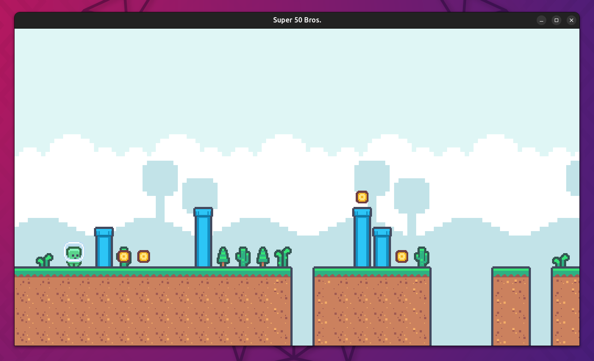
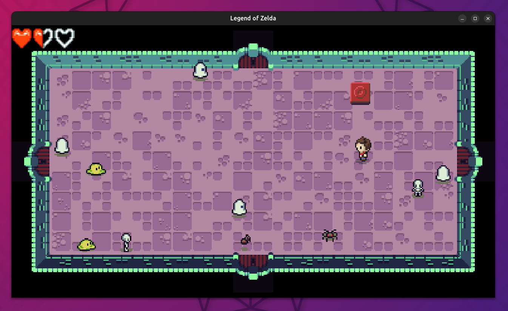
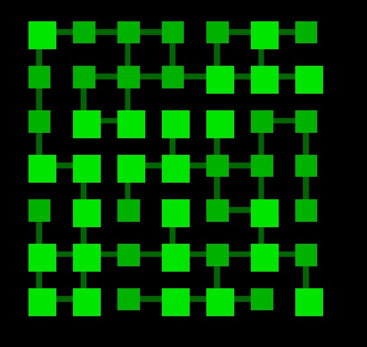

# GD50: 2D Videogames 🕹️👾🎮

My work on the first part of [**CS50's Introduction to Game Development**](https://www.edx.org/learn/game-development/harvard-university-cs50-s-introduction-to-game-development) course, offered by Harvard University. This section is about 2D videogames.  

It contains the recreated videogames of each lecture with a personal style, and the assignments of each one. Videogames are developed in **Lua**, with [LÖVE 2D](https://github.com/love2d/love) framework.  

> [!IMPORTANT]  
> To **run a game**, execute `love myGame` with LÖVE installed

## 1. Pong

Retro-aesthetic **Pong** as the classic videogame.  

| | |
|---|---|

|  |
| -- |  

Interesting topics covered by the lecture:
- DeltaTime and Velocity
- OOP
- Hitboxes (box collision)
- Game state
- Drawing shapes and text
- Sound effects 

## 2. Flappy Bird

My version of Flappy Bird, **Dizzy Bird**.  

Graphics and sound effects made by me.  

| | |
|---|---|

|  |
|--| 

Interesting topics covered by the lecture:
- Procedural generation and randomness
- Infinite scrolling
- Usage of sprites
- State Machine
- Simple physics

## 3. Breakout

**Breakout** or **Arkanoid**-like videogame.  

Made with same assets as the used in the lecture.

|  | |
|---|---|

|  |
|--| 

Interesting topics covered by the lecture:
- Sprite sheets
- Procedural layouts and levels
- Advanced state managing
- Particle system
- Improved collision and ricochet 

## 4. Match 3

Tile-matching videogame, such as the famous puzzle games **Candy Crush** or **Bejeweled**. It incorporates the same sprites and much of the code from the course. The key learning focus was on mastering timer controls and implementing tweening for dynamic tile and color animations.  

Made with same assets as the used in the lecture.

|  | |
|---|---|

|  |
|--| 

Interesting topics covered by the lecture:
- Animations with tweening
- Timer machine
- Procedural grids

## 5. Platformer

A basic platformer like **Mario Bros** or **Spelunky** (due to its procedural level generation).  

[Graphics assets used](https://opengameart.org/content/pixel-platformer-0)  

> [!NOTE]
> **TO DO**: Fix the entity system

|  | |
|---|---|

|  |
|--| 

Interesting topics covered by the lecture:
- Platformer physics
- Advanced level procedural generation
- Tile maps
- 2D animations
- Entities

## 6. Dungeon game

Videogame with dungeon map, like the classic **Zelda**, with the essence of **The Binding of Isaac** for the mobs and random dungeon generator. I developed a graph algorithm for creating procedural dungeon maps, each room having some certain neighbors every time initialized. 

Same assets as the lecture.  

|Videogame|Model of dungeon map generated randomly|
|---|---|
|  | |

Interesting topics covered by the lecture:
- Top-down perspective
- Procedural dungeon generator
- Random map generation with graphs
- Hitboxes
- Screen-scrolling